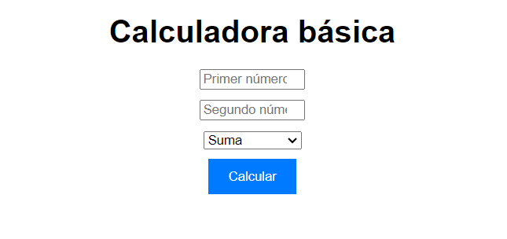

######
# Calculadora Simple
- Autor: **Andrés Navarro Villanueva**
- Licencia: MIT

## Descripción del proyecto:
Este proyecto consiste en una calculadora web simple que permite realizar operaciones básicas de suma, resta, multiplicación y división entre dos números. La aplicación está desarrollada utilizando HTML5, CSS3 y JavaScript, ofreciendo una interfaz intuitiva y fácil de usar.
## Objetivos
Desarrollar una calculadora que permita realizar operaciones matemáticas básicas.
Proporcionar una herramienta útil y práctica para realizar cálculos rápidos y sencillos.
## Tecnologías Utilizadas
**HTML5, CSS3 y JS**
 - 

 Para la estructura y organización del contenido de la página web.
 - 
 
 Para el diseño, estilo y presentación visual de la calculadora.
 - 
 
 Para la funcionalidad interactiva de la calculadora, incluyendo la lógica de las operaciones matemáticas y la interacción con el usuario.

 - Requisitos:
Un navegador web como Chrome o Firefox
## Arquitectura del proyecto
La estructura del proyecto se compone de los siguientes elementos:

- index.html: El archivo principal que contiene la estructura HTML de la página web.
- style.css: El archivo que define los estilos de la calculadora, incluyendo colores, tipografías, tamaños, etc.
- script.js: El archivo que contiene el código JavaScript que implementa la funcionalidad de la calculadora, incluyendo la lógica de las operaciones matemáticas, la interacción con los elementos HTML y el manejo de eventos.
- [Cómo funciona la calculadora](README.md) README.md
## Funcionalidades
La calculadora permite ingresar dos números (Aceptará única y exclusivamente caracteres númericos).
Los números pueden ser positivos o negativos.
Se pueden realizar las operaciones básicas de suma, resta, multiplicación y división.
El resultado de la operación se muestra por separado.
## Instrucciones de instalación y uso
> Clonar el repositorio:
Clona el repositorio del proyecto en tu computadora local utilizando Git o un software de control de versiones similar. También puedes descargar directamente el archivo .zip.


 - La URL de descarga es:
[https://github.com/AndresNavi/calculadorabasica.git](https://github.com/AndresNavi/calculadorabasica.git)

 - El comando para clonar el repositorio es:
```shell
git clone https://github.com/AndresNavi/calculadorabasica.git
```
Una vez descargado incluyalo en un repositorio y ejecutalo a través de un navegador.
```
http://localhost:3000/calculadorabasica
```
- Abrir el proyecto en un navegador web:
Abre el archivo index.html en un navegador web como Chrome, Firefox o Safari.
- Utilizar la calculadora:
Ingresa dos números en los campos de texto correspondientes.
Selecciona la operación que deseas realizar (suma, resta, multiplicación o división) utilizando los botones correspondientes.

<Haz clic en el botón "Calcular" para obtener el resultado de la operación.>

Una vez descargado incluyalo en un repositorio y ejecutalo a través de un navegador.
```
http://localhost:3000/calculadorabasica
```
## Solución de problemas comunes
> La calculadora no muestra el resultado:

- Verifica que hayas ingresado dos números correctamente.
- Asegúrate de haber seleccionado la operación deseada.
- Comprueba que no haya errores en el código JavaScript. Puedes comprobarlo accediendo a la consola en Inspeccionar tu página.
- La calculadora muestra un resultado incorrecto:
- Asegúrate de haber seleccionado la operación deseada correctamente.
- Comprueba que no haya errores en el código JavaScript que realiza las operaciones matemáticas.


## Información de contacto:
Puedes contactar conmigo en
[tandem.andresnv@gmail.com](mailto:tandem.andresnv@gmail.com)
[Teléfono: 677 111 111](tel:+34677111111)

## Versiones
|Versión|Fecha|Cambios|
|--|--|--|
|1|19/04/24|funcionalidad básica|
|1|19/04/24|creación de documentación|